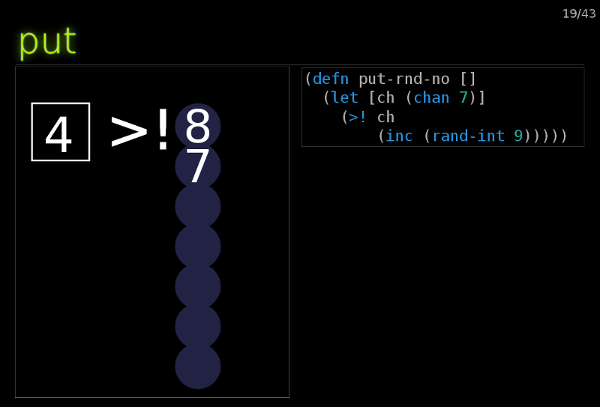

# QCon slides

An [Om](https://github.com/swannodette/om)-powered HTML slide-deck.

## Discussion

There are numerous HTML-based tools out there
([reveal.js](http://lab.hakim.se/reveal-js/#/),
[slidy](http://www.w3.org/Talks/Tools/Slidy2/Overview.html#%281%29),
[impress.js](http://bartaz.github.io/impress.js/#/bored),
[deck.js](http://imakewebthings.com/deck.js/), etc..) for building
slide-based presentations for conference talks, etc.

But I find they have a number of disadvantages, at least for me :

1. You usually have to write your slides in raw HTML. This feels cumbersome when you're used to writing LISP s-expressions with paredit.

2. If you want to build in more interactivity, you have to be proficient in JavaScript.

In March 2014 I gave a presentation at QCon in London for which I built
a slide-deck in [Om](https://github.com/swannodette/om).

If you're reading this on an old-style computer with a keyboard then you
can view it here http://qcon.juxt.pro/index.html. Use the left/right
arrow keys.



On this slide (slide 19) you can click in the black box and on the `>!`
and `<!` symbols, and there are other interactive slides following this
to help explain some [core.async](https://github.com/clojure/core.async)
concepts with some visualisations.

You write your slides in EDN. For most slides, you can use simple conventions like this :

```clojure
{:title "Hello"
 :bullets ["Point 1" "Point 2" "Point 3"]}
```

You can add a `:custom` key which references a _custom slide_, which is an Om component.

```clojure
(defn go-block-slide [data owner opts]
...
)

{:subtitle "go blocks"
             :custom go-block-slide
             :code {:source "qcon.examples/demo-go-loop"
                    :lang :clojure
                    }
             :opts {:width 600 :height 600
                    :circles 7
                    :radius 60 :font-size "40pt"}}
```

Om seems ideal for slide-decks. Om's component modularity protects the
independence of individual custom slides, so they can be transferred to
other decks easily. I've found that, as a Clojure developer, building
slides this way has been much easier than building them with JavaScript.

Om is also great for SVG interactivity. Firstly, React supports SVG
nodes as well as HTML ones, so you get both the convenience of rending a
diagram in [immediate mode](http://en.wikipedia.org/wiki/Immediate_mode)
without sacrificing performance. Using ClojureScript and go-blocks wins
hands-down against
[standard SVG animation](http://www.w3.org/TR/SVG/animate.html)
techniques.

If anyone would like to re-use some or all of this code for an upcoming
talk or presentation, please feel free to use anything here if it
helps. If there is enough interest, we could separate the common
functions into a small library.

## Getting started

```
mkdir om-slides-example
cd om-slides-example
git clone https://github.com/juxt/qcon2014
git clone https://github.com/juxt/jig
cd jig
git checkout 2.0.3
```

Make a Jig config file at `$HOME/.jig/config.clj`, with the following contents.


```clojure
#=(eval
   (-> (clojure.core/read-string (slurp "/home/malcolm/src/om-slides-example/qcon2014/config.clj"))
       ))
```

Important: Replace the path
`/home/malcolm/src/om-slides-example/qcon2014/config.clj` with the
location of the qcon `config.clj` file you've cloned.

From the jig directory :-

```
lein repl
Jig user> (go)
Jig user> (reset)
Jig user> (reset)

```

Do a `(reset)` every time you change a file and Jig will recompile the
modified clojurescript and reload the modified clojure.
